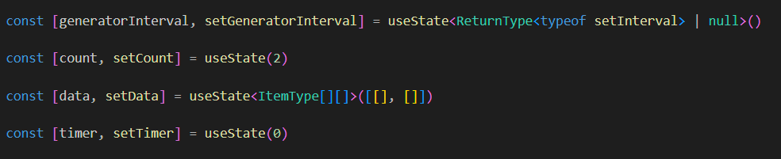

# Multi Channel Random Data Charts

## Tools
- React
- Typescript
- Vite
- framer-motion
- react-icons
- Tailwind.css

----

## Usage

### Control buttons

You can declare the channel count and control the iteration.
When you click start, timer will start and  the stop button will be available to click.

### Chart
You can see the random data on the charts. You can click the save button and set name of the file and a json file will be downloaded. When you click to load button and select your file or drag & drop to over the button.

---

### Project Structure

Folder structure in `src` folder :

#### App.tsx
##### App component contains 4 state. 
`generatorInverval` : interval for generating new random number
`count` : count of channel(s)
`data`: 2 dimensional array for storing data
`timer` : timer for generating new random number

######  useEffect 
this use effect is using for that when we change the count value then it will add or remove the channel

##### Start,Stop and Reset Functions
This functions using for control buttons. 
![[Pasted image 20231130124350.png]]

---

#### Chart.tsx

Chart component takes 2 argument as title and data and shows the data  with  other components

---

#### ItemChart.tsx
This component is the  `Bar` of the `BarChart`.

`getRGB` function returns a RGB value for background color of the bar. Its running like a hash function because its returns the same color for same value therefore when you upload a saved state, you can see the same chart.

---

##### DataControls.tsx
DataControls component is using for the `save/load` process.

## For more detail you can inspect the code , I added many comment lines